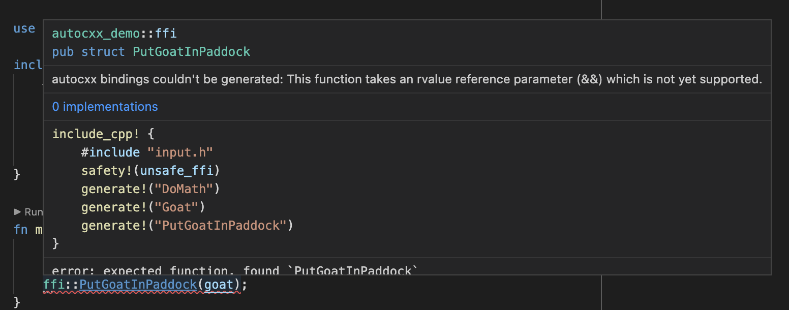

# Workflow

C++ is complex, and `autocxx` can't ingest everything.

First tip - use an IDE. Type annotation and autocompletion is _incredibly_ helpful in an `autocxx`
context, where you may be dealing with `UniquePtr<T>` and `Option<&T>` and `Pin<&mut T>` very often.


As you'll see, it's also _essential_ when `autocxx` can't produce bindings for some reason.

## General workflow

Here's how to approach autocxx:

```mermaid
flowchart TB
    %%{init:{'flowchart':{'nodeSpacing': 60, 'rankSpacing': 30}}}%%
    try[Try it!]
    fail(Build failed)
    missing_api(Build worked, but my API has disappeared)
    ok(All OK)
    try-->fail
    try-->missing_api
    try-->ok
    block[Block APIs]
    fail-->block
    block-->try
    expand[cargo expand or check docs in IDE]
    missing_api-->expand
    manual[Add manual cxx::bridge or extra C++ APIs for anything missing]
    expand-->manual
    manual-->try
```

This section explains more about this cycle.

## The build entirely failed

`autocxx` should nearly always successfully parse the C++ codebase and
generate _some_ APIs. It's reliant on `bindgen`, but `bindgen` is excellent
and rarely bails out entirely.

If it does, you may be able to use the [`block!` macro](https://docs.rs/autocxx/latest/autocxx/macro.block.html).

We'd appreciate a minimized bug report of the troublesome code - see [contributing](contributing.md).

## The build works, but didn't generate the API I expected

Once you've achieved a successful build, you might wonder how to know what
bindings have been generated. `cargo expand` will show you. Alternatively,
you can get autocompletion within an IDE supported by Rust analyzer. You'll
need to enable _both_:
* Rust-analyzer: Proc Macro: Enable
* Rust-analyzer: Experimental: Proc Attr Macros

Either way, you'll find (for sure!) that `autocxx` hasn't been able to generate
bindings for all your C++ APIs. This may manifest as a hard failure or a soft
failure:
* If you specified such an item in a [`generate`](https://docs.rs/autocxx/latest/autocxx/macro.generate.html) directive (or similar such
  as [`generate_pod`](https://docs.rs/autocxx/latest/autocxx/macro.generate_pod.html)) then your build will fail.
* If such APIs are methods belonging to a type, `autocxx` will generate other
  methods for the type but ignore those.

In this latter case, you should see helpful messages _in the generated bindings_
as rust documentation explaining what went wrong.



If this happens (and it will!) your options are:
* Add more, simpler C++ APIs which fulfil the same need but are compatible with
  `autocxx`.
* Write manual bindings. This is most useful if a [type is supported](https://cxx.rs/bindings.html) by `cxx`
  but not `autocxx` (for example, at the time of writing `std::array`). See
  the later section on 'combinining automatic and manual bindings'.

## Mixing manual and automated bindings

`autocxx` uses [`cxx`](https://cxx.rs) underneath, and its build process will happily spot and
process and manually-crafted [`cxx::bridge` mods](https://cxx.rs/concepts.html) which you include in your
Rust source code. A common pattern good be to use `autocxx` to generate
all the bindings possible, then hand-craft a `cxx::bridge` mod for the
remainder where `autocxx` falls short.

To do this, you'll need to use the [ability of one cxx::bridge mod to refer to types from another](https://cxx.rs/extern-c++.html#reusing-existing-binding-types),
for example:

```rust,ignore
autocxx::include_cpp! {
    #include "foo.h"
    safety!(unsafe_ffi)
    generate!("take_A")
    generate!("A")
}
#[cxx::bridge]
mod ffi2 {
    unsafe extern "C++" {
        include!("foo.h");
        type A = crate::ffi::A;
        fn give_A() -> UniquePtr<A>; // in practice, autocxx could happily do this
    }
}
fn main() {
    let a = ffi2::give_A();
    assert_eq!(ffi::take_A(&a), autocxx::c_int(5));
}
```
